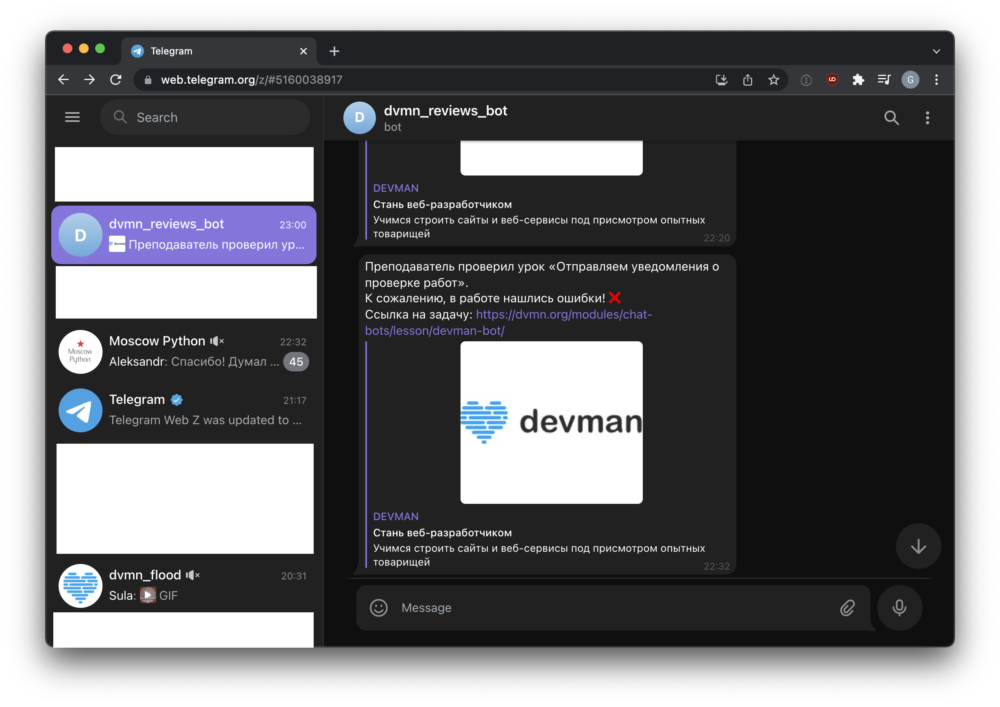

# Dvmn review notifier bot

This telegram bot project notifies you every time you get a code review on [Dvmn](https://dvmn.org/) homework.



## Features
- `long polling` API utilization
- Notifies you instantly on every code review
- Tells you code review results
- Heroku ready!
- Error logging

## Run with `Docker`
1. Clone project
```bash
git clone https://github.com/gennadis/dvmn_bot.git
cd dvmn_bot
```

2. Build `Docker` image
```bash
docker build --tag dvmn-review-bot .
```

3. Rename `.env.example` to `.env` and place your secrets in it.  

4. Run `Docker` container
```bash
docker run -d --name review-bot --env-file ./.env dvmn-review-bot
```

## Installation
1. Clone project
```bash
git clone https://github.com/gennadis/dvmn_bot.git
cd dvmn_bot
```

2. Create virtual environment
```bash
python3 -m venv venv
source venv/bin/activate
```

3. Install requirements
```bash
pip install -r requirements.txt
```

4. Rename `.env.example` to `.env` and place your secrets in it.  

5. Run telegram bot
```bash
python bot.py
```
